# Especificación de Casos de Uso - Proyecto Muses

Este documento contiene la especificación detallada de los Casos de Uso del sistema **Muses**. Cada Caso de Uso ($CU-XX$) se corresponde con una característica funcional (*Feature* $FXX$) definida en el proyecto.

---

## 1. Diagrama General de Casos de Uso

```mermaid
graph LR
    actorJugador((Jugador))
    actorSistema((Sistema / Backend))
    actorBot((Bot IA))

    subgraph Muses System
        subgraph Usuarios y Autenticación
            CU08[CU-08: Registrar e iniciar sesión de usuario]
            CU20[CU-20: Consultar perfil y estadísticas]
        end

        subgraph Gestión de Partida y Salas
            CU33[CU-33: Crear sala de juego]
            CU34[CU-34: Unirse a la sala de juego]
            CU35[CU-35: Gestionar desconexión de jugadores]
        end

        subgraph Inicialización y Tablero
            CU09[CU-09: Generar disposición inicial 9 Musas]
            CU10[CU-10: Repartir cartas de acción iniciales]
            CU11[CU-11: Asignar carta de Inspiración]
            CU12[CU-12: Establecer posición inicial Sol y Luna]
            CU01[CU-01: Identificar Musas en posición Sol y Luna]
            CU02[CU-02: Mover tokens Sol y Luna en sentido horario]
            CU03[CU-03: Rotar en Revolución las Musas del tablero]
        end

        subgraph Lógica de Turno y Cartas
            CU04[CU-04: Seleccionar carta de acción]
            CU05[CU-05: Resolver conflictos de prioridad]
            CU06[CU-06: Ejecutar acción de la carta jugada]
            CU07[CU-07: Validar disponibilidad de Inspiración]
            CU13[CU-13: Incrementar contador de ronda]
        end

        subgraph Recuento y Puntuación
            CU14[CU-14: Finalizar sesión tras novena ronda]
            CU15[CU-15: Contabilizar tokens de devoción]
            CU16[CU-16: Calcular puntos obtenidos por Musa]
            CU17[CU-17: Resolver empates de puntuación]
            CU18[CU-18: Calcular puntuación final]
            CU19[CU-19: Determinar ganador de la partida]
        end

        subgraph Bot Autómata
            CU31[CU-31: Calcular mejor jugada para bot]
            CU32[CU-32: Ejecutar acciones del bot]
        end
    end

    actorJugador --> CU08
    actorJugador --> CU20
    actorJugador --> CU33
    actorJugador --> CU34
    actorJugador --> CU04
    
    actorSistema --> CU35
    actorSistema --> CU09
    actorSistema --> CU10
    actorSistema --> CU11
    actorSistema --> CU12
    actorSistema --> CU01
    actorSistema --> CU02
    actorSistema --> CU03
    actorSistema --> CU05
    actorSistema --> CU06
    actorSistema --> CU07
    actorSistema --> CU13
    actorSistema --> CU14
    actorSistema --> CU15
    actorSistema --> CU16
    actorSistema --> CU17
    actorSistema --> CU18
    actorSistema --> CU19

    actorBot --> CU31
    actorBot --> CU32
```

---

## 2. Tablas de Casos de Uso (Mapeo 1:1 con Features)

### Módulo: Autenticación y Perfil

| CU-08 | Registrar e iniciar sesión de usuario |
| :--- | :--- |
| **Descripción** | Un usuario no autenticado accede a la plataforma para registrar una nueva cuenta o iniciar sesión con sus credenciales. |
| **Precondición** | El usuario accede a la pantalla de inicio o autenticación del sistema. |
| **Secuencia normal** | **Paso 1:** El usuario selecciona la opción "Login" o "Registro". **Paso 2:** Introduce sus credenciales (username/email y contraseña). **Paso 3:** El sistema valida la información, genera el token de sesión (JWT) y concede acceso al panel principal. |
| **Postcondición** | El usuario queda autenticado activamente en el sistema. |
| **Excepciones** | **Paso 2-3:** Si las credenciales son incorrectas o el usuario ya existe, el sistema muestra un mensaje de error. |

---

| CU-20 | Consultar perfil y estadísticas de usuario |
| :--- | :--- |
| **Descripción** | El usuario autenticado visualiza su información de perfil y el acumulado de estadísticas (partidas jugadas, victorias, derrotas y puntos). |
| **Precondición** | El usuario ha iniciado sesión en el sistema. |
| **Secuencia normal** | **Paso 1:** El usuario selecciona la opción "Mi Perfil". **Paso 2:** El sistema recupera el registro de estadísticas del backend (`Usuario` y `Estadisticas`). **Paso 3:** El sistema muestra los datos resumidos y gráficos de rendimiento. |
| **Postcondición** | Métricas de usuario presentadas sin alteración de datos. |
| **Excepciones** | Ninguna. |

---

### Iteración 1: Mecánicas del Tablero

| CU-01 | Identificar Musas en posición de Sol y Luna |
| :--- | :--- |
| **Descripción** | El sistema identifica qué cartas de Musa están situadas directamente adyacentes a las fichas astronómicas de Sol ("Sunlight") y Luna ("Moonlight") en el tablero 3x3. |
| **Precondición** | El tablero debe estar inicializado y los marcadores de Sol y Luna posicionados en el perímetro. |
| **Secuencia normal** | **Paso 1:** El sistema consulta las coordenadas actuales de los marcadores Sol y Luna. **Paso 2:** El sistema determina las Musas ocupantes de las casillas contiguas. **Paso 3:** El sistema devuelve las referencias a las Musas solares y lunares activas. |
| **Postcondición** | Las Musas en posición solar y lunar quedan identificadas para la aplicación de efectos. |
| **Excepciones** | **Paso 1-2:** Si los marcadores están fuera de rango o el grid es inconsistente, el sistema emite una excepción de estado de tablero inválido. |

---

| CU-02 | Mover un espacio en sentido horario el token de Sol y de Luna |
| :--- | :--- |
| **Descripción** | El sistema desplaza los marcadores astronómicos de Sol y Luna una posición en sentido horario alrededor del perímetro del grid de 3x3 al finalizar cada turno. |
| **Precondición** | La fase de resolución de acciones del turno actual ha finalizado. |
| **Secuencia normal** | **Paso 1:** El sistema calcula el índice de siguiente posición en sentido horario ($pos = (pos + 1) \pmod 8$). **Paso 2:** El sistema actualiza las coordenadas de Sol y Luna en el modelo. **Paso 3:** El sistema notifica la nueva posición a todos los clientes. |
| **Postcondición** | Los tokens astronómicos quedan avanzados un paso en sentido horario. |
| **Excepciones** | Ninguna. |

---

| CU-03 | Rotar en Revolución las Musas del tablero |
| :--- | :--- |
| **Descripción** | El sistema ejecuta el desplazamiento cíclico de las cartas de Musas del grid cuando se activa una acción de *Revolución Sol* o *Revolución Luna*. |
| **Precondición** | Se ha jugado y validado una carta de Revolución. |
| **Secuencia normal** | **Paso 1:** El sistema coloca 1 token de Devoción en la Musa central. **Paso 2:** El sistema mueve la Musa central en dirección al astro correspondiente (Sol o Luna). **Paso 3:** El sistema desplaza en sentido horario las Musas circundantes impulsando la Musa del astro opuesto hacia la casilla central. |
| **Postcondición** | La cuadrícula de Musas queda reordenada con una nueva Musa en la posición central. |
| **Excepciones** | **Paso 2-3:** Si el tipo de revolución no es válido, el sistema cancela la rotación y devuelve error. |

---

### Iteración 2: Mecánicas de Cartas

| CU-04 | Seleccionar la carta de acción desde la mano del jugador |
| :--- | :--- |
| **Descripción** | El jugador elige secretamente una de las cartas de su mano para jugarla durante la ronda activa. |
| **Precondición** | La ronda está en estado de selección de acción y el jugador no ha confirmado aún su elección. |
| **Secuencia normal** | **Paso 1:** El jugador selecciona una carta de su área privada. **Paso 2:** El cliente envía la orden codificada al backend. **Paso 3:** El sistema registra la selección y bloquea la mano del jugador hasta el revelado. |
| **Postcondición** | La carta queda fijada en el estado del turno del jugador. |
| **Excepciones** | **Paso 2:** Si el tiempo de selección expira, el sistema asigna de forma predeterminada una carta no consumida. |

---

| CU-05 | Resolver los conflictos de prioridad en las cartas jugadas |
| :--- | :--- |
| **Descripción** | El sistema establece el orden cronológico de resolución de las cartas reveladas por todos los jugadores en la ronda. |
| **Precondición** | Todos los jugadores han seleccionado carta o el temporizador ha finalizado. |
| **Secuencia normal** | **Paso 1:** El sistema revela las cartas elegidas. **Paso 2:** El sistema contabiliza cuántos jugadores eligieron cada tipo de carta. **Paso 3:** El sistema ordena la ejecución dando prioridad a la carta más votada. **Paso 4:** En caso de empate en recuento, desempata mediante la jerarquía de prioridad: 1. Inspiración, 2. Devoción Sol, 3. Revolución Sol, 4. Revolución Luna, 5. Devoción Luna. |
| **Postcondición** | La lista de ejecución ordenada queda lista para aplicarse. |
| **Excepciones** | Ninguna. |

---

| CU-06 | Ejecutar la acción de la carta jugada |
| :--- | :--- |
| **Descripción** | El sistema aplica los efectos concretos de las cartas seleccionadas en el tablero de juego (colocar tokens de devoción o activar revoluciones). |
| **Precondición** | El orden de resolución de acciones ha sido calculado. |
| **Secuencia normal** | **Paso 1:** El sistema toma la siguiente acción de la lista priorizada. **Paso 2:** Si es Devoción (Sol/Luna), coloca 2 fichas en la Musa solar/lunar correspondiente. **Paso 3:** Si es Revolución (Sol/Luna), ejecuta CU-03. **Paso 4:** Si es Inspiración, ejecuta los fuegos de devoción en las posiciones indicadas. |
| **Postcondición** | El estado del tablero se actualiza con los tokens y posiciones resultantes. |
| **Excepciones** | Ninguna. |

---

| CU-07 | Validar la disponibilidad de la carta de Inspiración |
| :--- | :--- |
| **Descripción** | El sistema comprueba que una carta de Inspiración no haya sido jugada previamente en la partida y que la disposición de Sol y Luna cumpla la restricción geográfica (lados vs esquinas). |
| **Precondición** | El jugador intenta seleccionar su carta de Inspiración. |
| **Secuencia normal** | **Paso 1:** El sistema verifica que la propiedad `usada` sea `false`. **Paso 2:** El sistema comprueba si la carta requiere astros en esquinas o en laterales y lo contrasta con la posición actual. **Paso 3:** Si la validación es satisfactoria, permite el juego de la carta. |
| **Postcondición** | La carta de Inspiración se marca como `usada = true` tras su ejecución. |
| **Excepciones** | **Paso 1-2:** Si ya fue usada o la posición astronómica no coincide, el sistema rechaza la selección y notifica al jugador. |

---

### Iteración 3: Gestión de Partida y Sistema de Puntuación

| CU-09 | Generar la disposición inicial de las 9 Musas en el tablero |
| :--- | :--- |
| **Descripción** | El sistema baraja aleatoriamente el mazo de 9 Musas y las posiciona en una cuadrícula de 3x3 al comienzo de la partida. |
| **Precondición** | Partida iniciada por el anfitrión. |
| **Secuencia normal** | **Paso 1:** El sistema recupera el conjunto de 9 cartas de Musas. **Paso 2:** Aplica un algoritmo de barajado aleatorio (*Fisher-Yates*). **Paso 3:** Ocupa las 9 posiciones del grid (índices 0 a 8). |
| **Postcondición** | El grid 3x3 queda configurado. |
| **Excepciones** | Ninguna. |

---

| CU-10 | Repartir las cartas de acción iniciales a los jugadores |
| :--- | :--- |
| **Descripción** | Asigna a cada participante su mano permanente de 4 cartas de acción. |
| **Precondición** | Jugadores unidos a la partida. |
| **Secuencia normal** | **Paso 1:** El sistema instancia las cartas *Devoción Sol*, *Devoción Luna*, *Revolución Sol*, *Revolución Luna* para cada jugador. **Paso 2:** Sincroniza la mano privada en los clientes. |
| **Postcondición** | Cada jugador posee exactamente sus 4 cartas de acción iniciales. |
| **Excepciones** | Ninguna. |

---

| CU-11 | Asignar una carta de Inspiración a cada jugador |
| :--- | :--- |
| **Descripción** | Selecciona y reparte aleatoriamente 1 carta de Inspiración del mazo de 9 inspiraciones a cada jugador. |
| **Precondición** | Mazo de Inspiraciones inicializado. |
| **Secuencia normal** | **Paso 1:** El sistema extrae de forma aleatoria una carta de Inspiración sin repetir. **Paso 2:** La asigna a la mano privada del jugador con estado `usada = false`. |
| **Postcondición** | Cada jugador dispone de una carta de Inspiración única. |
| **Excepciones** | Ninguna. |

---

| CU-12 | Establecer la posición inicial de los tokens de Sol y Luna |
| :--- | :--- |
| **Descripción** | Coloca los marcadores astronómicos de Sol y Luna en los laterales opuestos del tablero al principio de la partida. |
| **Precondición** | Grid de Musas inicializado. |
| **Secuencia normal** | **Paso 1:** El sistema asigna al Sol la posición lateral central (ej. superior). **Paso 2:** El sistema asigna a la Luna la posición lateral central opuesta (ej. inferior). |
| **Postcondición** | Posiciones iniciales de Sol y Luna fijadas. |
| **Excepciones** | Ninguna. |

---

| CU-13 | Incrementar el contador de ronda al finalizar el turno |
| :--- | :--- |
| **Descripción** | Avanza en 1 unidad el indicador global de ronda transcurrida tras finalizar la resolución del turno. |
| **Precondición** | Resolución de acciones y rotación de astros completadas. |
| **Secuencia normal** | **Paso 1:** El sistema lee la ronda actual ($Ronda$). **Paso 2:** Incrementa el contador ($Ronda = Ronda + 1$). **Paso 3:** Si $Ronda \le 9$, reabre la fase de selección para el siguiente turno. |
| **Postcondición** | El contador de ronda queda actualizado. |
| **Excepciones** | Ninguna. |

---

| CU-14 | Finalizar la sesión de juego al completar la novena ronda |
| :--- | :--- |
| **Descripción** | Detecta que se ha completado el turno 9 y transiciona la partida al estado de recuento final. |
| **Precondición** | El contador de ronda alcanza el valor 9 y concluye el turno. |
| **Secuencia normal** | **Paso 1:** El sistema verifica que $Ronda > 9$ o el Sol ha vuelto a la posición inicial. **Paso 2:** Cambia el estado de la partida a `FINISHED`. **Paso 3:** Desencadena el cálculo final de puntuaciones (CU-15 a CU-19). |
| **Postcondición** | La partida queda concluida para nuevos turnos. |
| **Excepciones** | Ninguna. |

---

| CU-15 | Contabilizar los tokens de devoción por jugador en cada Musa |
| :--- | :--- |
| **Descripción** | Realiza el cómputo del número total de fichas de devoción depositadas por cada participante en cada una de las 9 cartas de Musa. |
| **Precondición** | Partida en estado `FINISHED`. |
| **Secuencia normal** | **Paso 1:** El sistema recorre las 9 Musas del tablero. **Paso 2:** Por cada Musa, agrupa y cuenta los tokens pertenecientes a cada `JugadorId`. |
| **Postcondición** | Matriz de fichas por jugador y musa generada. |
| **Excepciones** | Ninguna. |

---

| CU-16 | Calcular los puntos obtenidos por cada Musa |
| :--- | :--- |
| **Descripción** | Asigna los puntos de los niveles (1º, 2º y 3º puesto) mostrados en la carta de Musa a los jugadores según la cantidad de tokens depositados. |
| **Precondición** | Conteo de fichas por Musa completado. |
| **Secuencia normal** | **Paso 1:** El sistema ordena los jugadores de mayor a menor número de tokens en la Musa. **Paso 2:** Asigna los puntos correspondientes a los 3 niveles impresos en la carta. **Paso 3:** Si no hay empates, otorga 1º nivel al mayor, 2º al segundo y 3º al tercero (siempre que tengan $\ge 1$ token). |
| **Postcondición** | Puntos asignados provisionalmente por Musa. |
| **Excepciones** | Ninguna. |

---

| CU-17 | Resolver los empates de puntuación |
| :--- | :--- |
| **Descripción** | Aplica el algoritmo oficial de desempate dividiendo y redondeando a la baja la suma de los niveles afectados entre los jugadores empatados. |
| **Precondición** | Se detecta igualdad de tokens entre dos o más jugadores en un puesto de una Musa. |
| **Secuencia normal** | **Paso 1:** Si 2 jugadores empatan en 1º puesto: se suman el 1º y 2º nivel de puntos y se dividen a partes iguales (redondeando abajo). **Paso 2:** Si 3+ jugadores empatan en 1º puesto: se suman los 3 niveles y se dividen a partes iguales entre ellos. **Paso 3:** Si 2 jugadores empatan en 2º puesto: se suman el 2º y 3º nivel y se dividen a partes iguales. |
| **Postcondición** | Puntos de empates distribuidos exactamente según el reglamento. |
| **Excepciones** | Ninguna. |

---

| CU-18 | Calcular la puntuación final de cada jugador |
| :--- | :--- |
| **Descripción** | Totaliza la suma de todos los puntos obtenidos por un jugador a lo largo de las 9 cartas de Musas. |
| **Precondición** | Puntos por cada Musa calculados y desempatados. |
| **Secuencia normal** | **Paso 1:** El sistema acumula por cada jugador la suma de puntos obtenidos en las 9 Musas. **Paso 2:** Almacena la puntuación final global. |
| **Postcondición** | Puntuaciones totales calculadas. |
| **Excepciones** | Ninguna. |

---

| CU-19 | Determinar el ganador de la partida |
| :--- | :--- |
| **Descripción** | Identifica al jugador o jugadores con la puntuación total más alta y proclama la victoria. |
| **Precondición** | Puntuaciones finales calculadas. |
| **Secuencia normal** | **Paso 1:** El sistema compara las puntuaciones totales de todos los participantes. **Paso 2:** Selecciona el valor máximo. **Paso 3:** Declara ganador(es) y envía el resumen a todos los clientes. |
| **Postcondición** | Ganador proclamado y partida registrada en histórico. |
| **Excepciones** | Ninguna. |

---

### Iteraciones 4 y 5: UI, Bot y Servicios

| CU-31 | Calcular la mejor jugada posible para el bot |
| :--- | :--- |
| **Descripción** | El componente de Inteligencia Artificial evalúa las opciones de su mano y selecciona la carta con mayor rendimiento esperado. |
| **Precondición** | Es la fase de selección de acción y participa un jugador autómata (Bot). |
| **Secuencia normal** | **Paso 1:** El motor del Bot analiza la posición de los astros y el recuento de fichas en cada Musa. **Paso 2:** Simula el impacto hipotético de cada carta disponible. **Paso 3:** Selecciona la carta de acción óptima. |
| **Postcondición** | Elección del Bot registrada en el backend. |
| **Excepciones** | Ninguna. |

---

| CU-32 | Ejecutar las acciones seleccionadas por el bot |
| :--- | :--- |
| **Descripción** | El sistema procesa de forma transparente la selección efectuada por el autómata durante la fase de resolución. |
| **Precondición** | Elección del Bot fijada. |
| **Secuencia normal** | **Paso 1:** El sistema trata la carta del Bot de manera equivalente a la de un jugador humano. **Paso 2:** Aplica sus efectos en la tabla de prioridades (CU-05 y CU-06). |
| **Postcondición** | Acción del Bot resuelta en el tablero. |
| **Excepciones** | Ninguna. |

---

| CU-33 | Crear la sala de juego |
| :--- | :--- |
| **Descripción** | Un jugador crea un lobby de partida especificando número de jugadores (3 a 5) y visibilidad. |
| **Precondición** | Usuario autenticado en el sistema. |
| **Secuencia normal** | **Paso 1:** El usuario solicita la creación de sala. **Paso 2:** El sistema asigna un identificador único y posiciona al creador como anfitrión. **Paso 3:** La sala queda visible en el listado de lobbies. |
| **Postcondición** | Sala creada en estado de espera. |
| **Excepciones** | **Paso 1:** Si el usuario ya está en otra partida activa, el sistema impide crear una nueva. |

---

| CU-34 | Unirse a la sala de juego |
| :--- | :--- |
| **Descripción** | Un jugador se conecta a una sala existente que dispone de plazas libres. |
| **Precondición** | Sala en estado de espera con menos de 5 jugadores. |
| **Secuencia normal** | **Paso 1:** El usuario selecciona la sala o ingresa su código. **Paso 2:** El sistema valida el aforo y la añade a la lista de participantes. **Paso 3:** Notifica a la sala el ingreso del nuevo jugador. |
| **Postcondición** | Jugador registrado en la sala. |
| **Excepciones** | **Paso 2:** Si la sala está llena o ha comenzado la partida, el sistema muestra un aviso de error. |

---

| CU-35 | Gestionar la desconexión de jugadores durante la partida |
| :--- | :--- |
| **Descripción** | El sistema detecta la pérdida de conexión de un jugador en medio del juego y toma medidas de tolerancia a fallos. |
| **Precondición** | Partida en curso. |
| **Secuencia normal** | **Paso 1:** El backend detecta la caída de la conexión WebSocket de un cliente. **Paso 2:** Concede un margen de reconexión. **Paso 3:** Si expira, el sistema sustituye temporal o permanentemente al jugador desconectado por un Bot autómata (CU-31). |
| **Postcondición** | La partida continúa sin bloqueo para el resto de jugadores. |
| **Excepciones** | Ninguna. |
