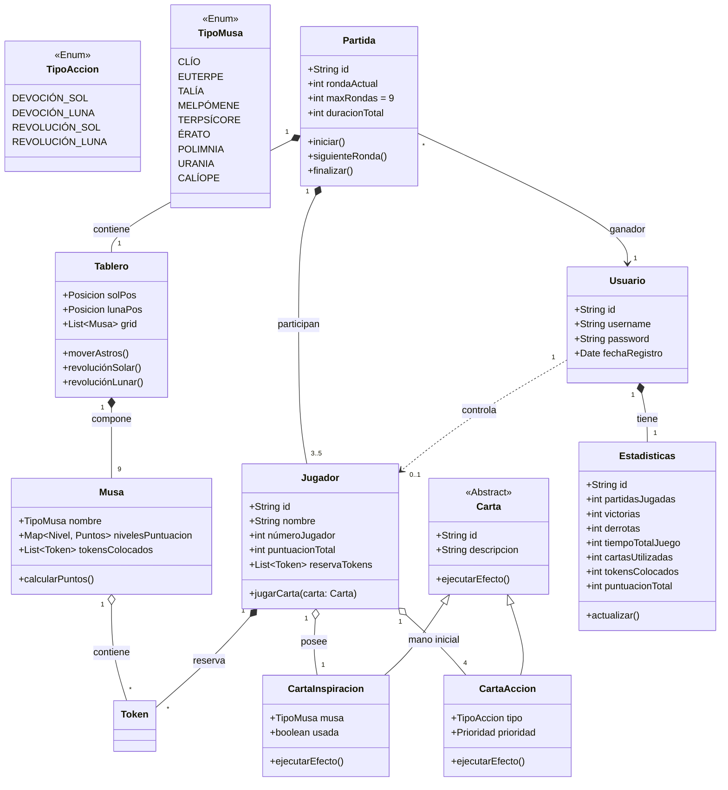

# Modelo de Dominio

## 1. Descripción del Modelo
Este documento formaliza la estructura lógica del sistema **Muses**. El modelo se divide en dos contextos claramente diferenciados: el **Dominio del Juego** (mecánicas de la partida) y el **Dominio de la Aplicación** (persistencia y usuarios).

### 1.1. Dominio del Juego (Core)
Las entidades de este contexto definen la lógica y mecánica de la partida.

*   **Partida (Match):** La entidad central que orquesta el juego. Es una **entidad persistente**: se crea al inicio, evoluciona durante el juego y su estado final quedará registrado en la base de datos.
*   **Tablero (Board):** Representa el grid de 3x3 y la posición de los astros.
*   **Jugador (Player):** Entidad que representa la participación de un usuario en una partida concreta (no confundir con Usuario).
*   **Elementos de Juego:** Incluye **Musas**, **Cartas** y **Tokens**, encargados de ejecutar las reglas.

### 1.2. Dominio de la Aplicación (Meta)
Estas entidades gestionan la información del sistema y los usuarios a largo plazo.

*   **Usuario (User):** La cuenta del jugador. Gestiona el acceso y mantiene su identidad.
*   **Estadísticas (Stats):** Registro acumulado del rendimiento del usuario.

## 2. Diagrama de Clases (UML)

