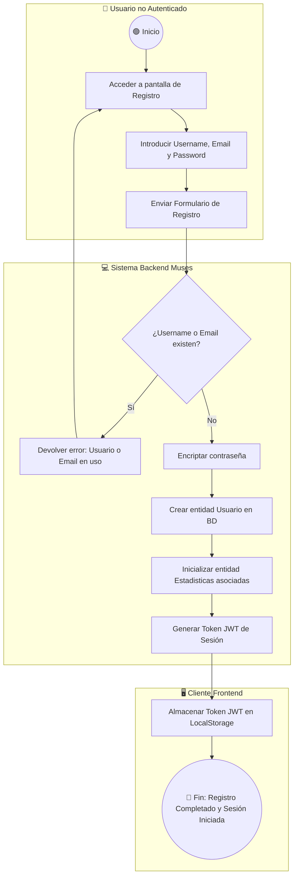
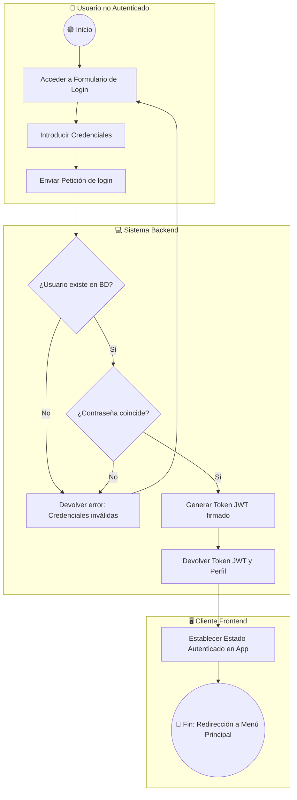
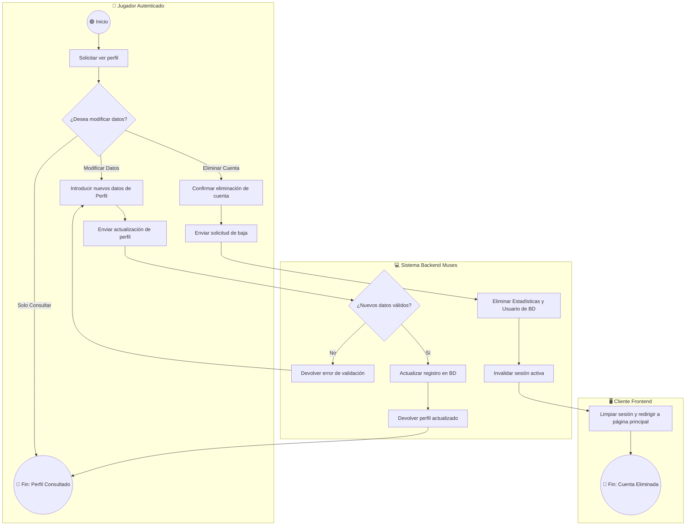
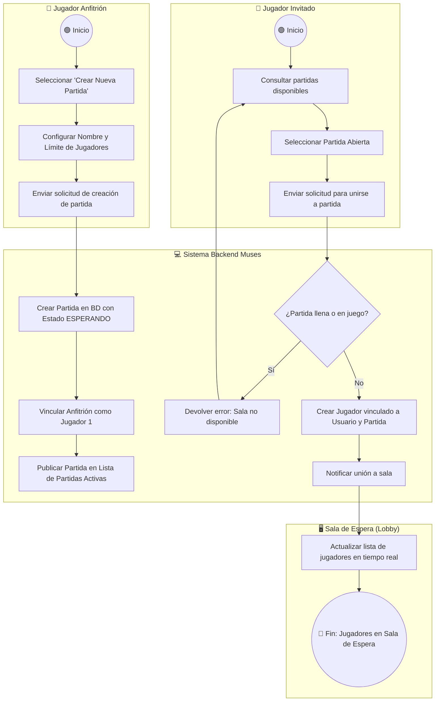
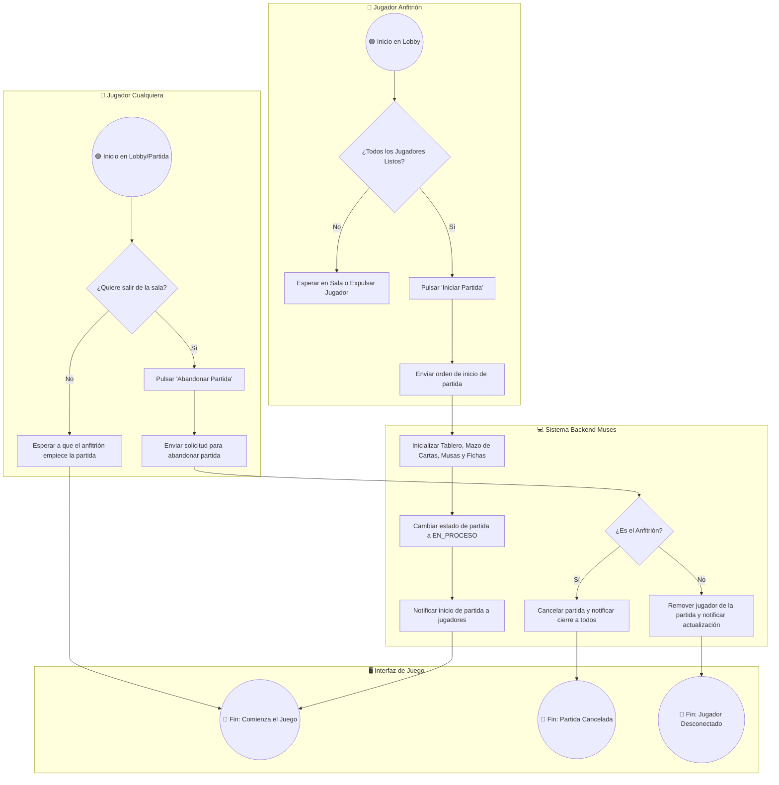
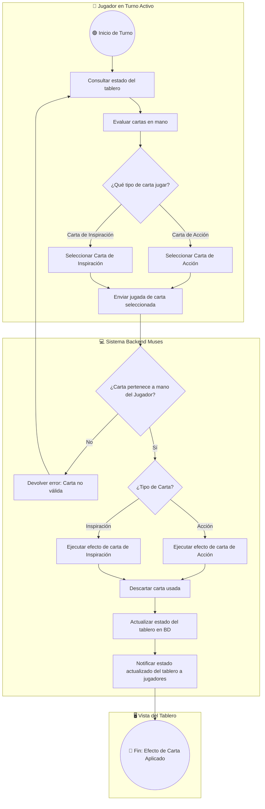
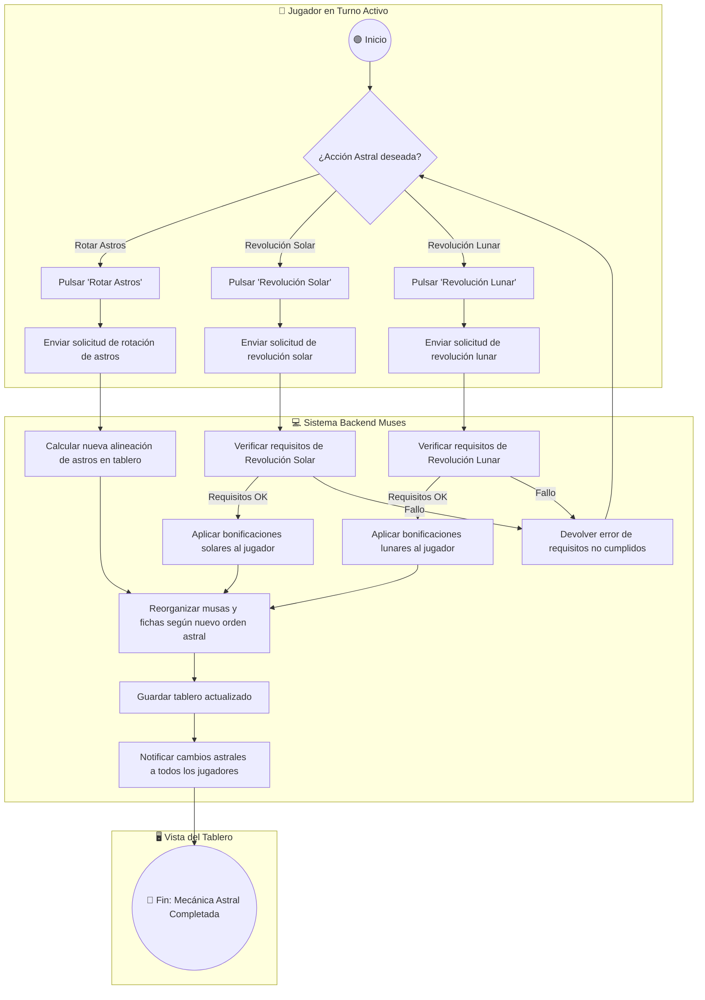
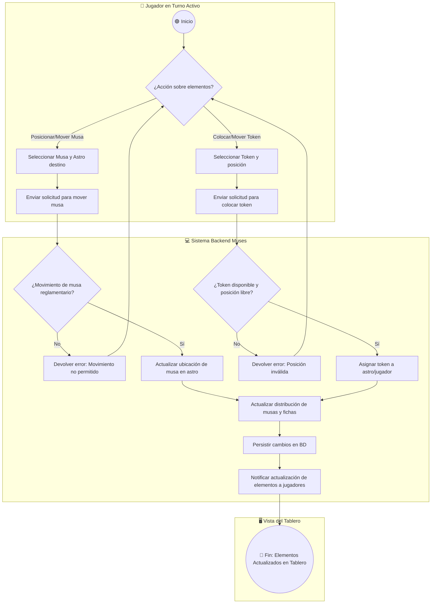
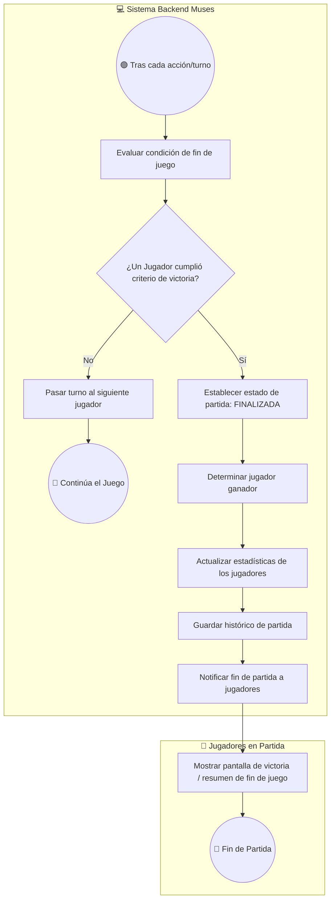
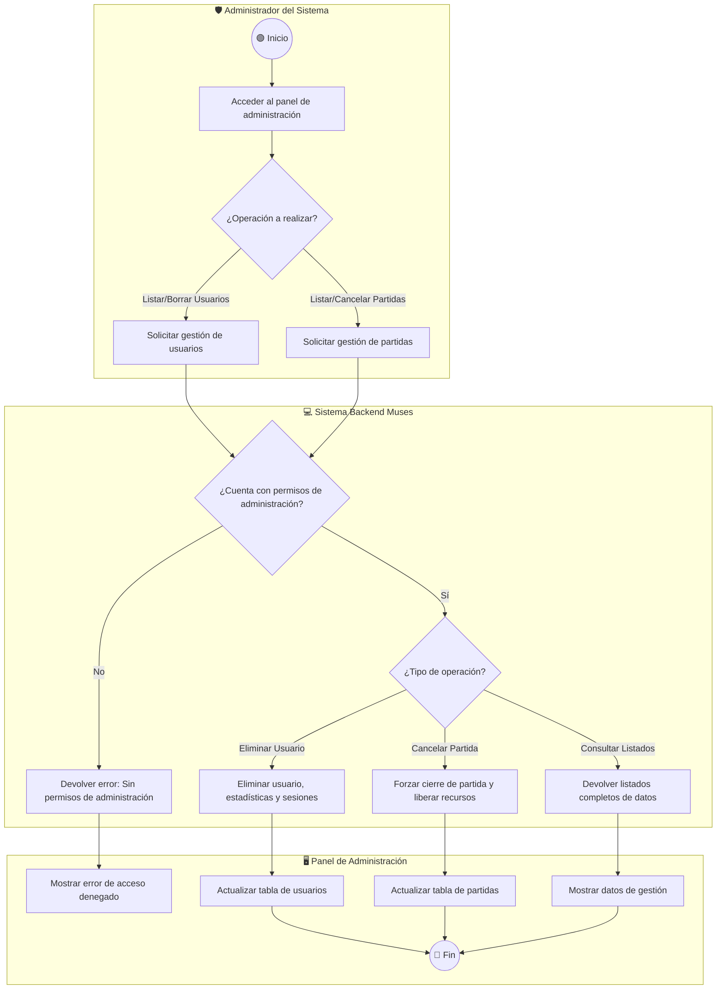

# Documento de Procesos de Negocio (BPMN) - Muses TFG

Este documento recoge la especificación y modelado de los **Procesos de Negocio** para la digitalización del juego de mesa **Muses**, cubriendo la totalidad de los Casos de Uso del sistema.

Los diagramas están elaborados utilizando la notación **Mermaid (`flowchart TD`)** compatible con BPMN 2.0 (eventos, tareas, decisiones y carriles de roles o *swimlanes*).

---

## 1. Simbología BPMN empleada en Mermaid

| Elemento BPMN | Representación gráfica | Sintaxis Mermaid | Descripción |
| :--- | :--- | :--- | :--- |
| **Evento** | Círculo | `(( Nombre del Evento ))` | Indica inicio, estado intermedio o fin del proceso. |
| **Tarea / Actividad** | Rectángulo | `[ Descripción de la Tarea ]` | Acción o paso ejecutado por un rol o sistema. |
| **Decisión / Compuerta** | Rombo | `{ ¿Condición? }` | Punto de bifurcación de flujo según resultado. |
| **Carril / Rol (Swimlane)** | Subgrafo / Contenedor | `subgraph Rol ["Rol"] ... end` | Define la entidad u actor responsable de la acción. |

---

## 2. Matriz de Casos de Uso vs Roles de Sistema

| Código CU | Nombre del Caso de Uso | Rol Principal | Rol Secundario / Sistema |
| :--- | :--- | :--- | :--- |
| **CU-01** | Registrar Nuevo Usuario | Usuario no Autenticado | Sistema Backend / Base de Datos |
| **CU-02** | Iniciar Sesión (Login) | Usuario no Autenticado | Sistema Backend |
| **CU-03** | Consultar Perfil de Usuario | Jugador Autenticado | Sistema Backend |
| **CU-04** | Modificar Perfil de Usuario | Jugador Autenticado | Sistema Backend |
| **CU-05** | Dar de Baja / Eliminar Cuenta | Jugador Autenticado | Sistema Backend |
| **CU-06** | Crear Nueva Partida | Jugador Anfitrión | Sistema Backend |
| **CU-07** | Listar y Buscar Partidas Activas | Jugador Autenticado | Sistema Backend |
| **CU-08** | Unirse a Partida Existente | Jugador Invitado | Sistema Backend |
| **CU-09** | Iniciar Partida desde Lobby | Jugador Anfitrión | Sistema Backend / Servicio WebSocket |
| **CU-10** | Abandonar / Cancelar Partida | Jugador / Anfitrión | Sistema Backend |
| **CU-11** | Consultar Estado del Tablero | Jugador en Partida | Sistema Backend |
| **CU-12** | Seleccionar y Jugar Carta de Acción | Jugador Activo | Sistema Backend |
| **CU-13** | Seleccionar y Jugar Carta de Inspiración | Jugador Activo | Sistema Backend |
| **CU-14** | Ejecutar Rotación de Astros | Jugador Activo | Sistema Backend |
| **CU-15** | Ejecutar Revolución Solar | Jugador Activo | Sistema Backend |
| **CU-16** | Ejecutar Revolución Lunar | Jugador Activo | Sistema Backend |
| **CU-17** | Mover y Posicionar Musas | Jugador Activo | Sistema Backend |
| **CU-18** | Gestionar Tokens / Fichas en Astros | Jugador Activo | Sistema Backend |
| **CU-19** | Evaluar Victoria y Cierre de Partida | Sistema Backend | Jugadores en Partida |
| **CU-20** | Consultar Estadísticas de Jugador | Jugador Autenticado | Sistema Backend |
| **CU-21** | Consultar Ranking y Métricas Globales | Jugador / Administrador | Sistema Backend |
| **CU-22** | Administración de Usuarios y Partidas | Administrador | Sistema Backend |

---

## 3. Diagramas de Procesos de Negocio por Módulo

### Módulo 1: Gestión de Usuarios y Autenticación (CU-01 a CU-05)

#### Proceso 1.1: Registro de Nuevo Usuario (CU-01)

#### Proceso 1.2: Iniciar Sesión / Login (CU-02)

#### Proceso 1.3: Gestión de Perfil de Usuario (CU-03, CU-04, CU-05)

---

### Módulo 2: Gestión de Partidas y Lobbies (CU-06 a CU-10)

#### Proceso 2.1: Crear Partida (CU-06) y Unirse a Lobby (CU-07, CU-08)

#### Proceso 2.2: Iniciar y Abandonar Partida (CU-09, CU-10)

---

### Módulo 3: Desarrollo del Juego y Mecánicas de Tablero (CU-11 a CU-19)

#### Proceso 3.1: Consulta de Tablero y Ejecución de Cartas (CU-11, CU-12, CU-13)

#### Proceso 3.2: Mecánicas Astrales - Rotación, Sol y Luna (CU-14, CU-15, CU-16)

#### Proceso 3.3: Gestión de Musas y Fichas/Tokens (CU-17, CU-18)

#### Proceso 3.4: Verificación de Victoria y Cierre de Partida (CU-19)

---

### Módulo 4: Estadísticas, Ranking y Administración (CU-20 a CU-22)

#### Proceso 4.1: Consulta de Estadísticas Personales y Globales (CU-20, CU-21)

#### Proceso 4.2: Administración de Usuarios y Partidas (CU-22)

---

## 4. Conclusión

Este documento proporciona una visión completa e integrada de los **22 Casos de Uso** del sistema **Muses**. Todos los diagramas utilizan un nivel de abstracción conceptual centrado en la lógica de negocio, libre de detalles de implementación de bajo nivel como endpoints de API o códigos HTTP.
