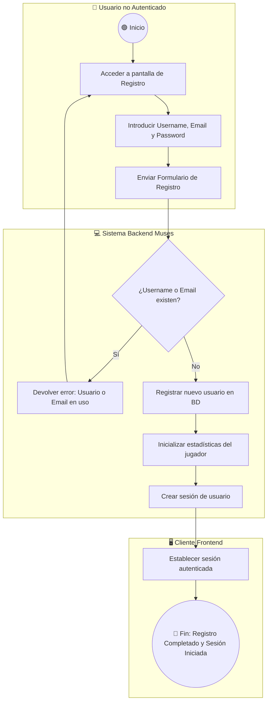
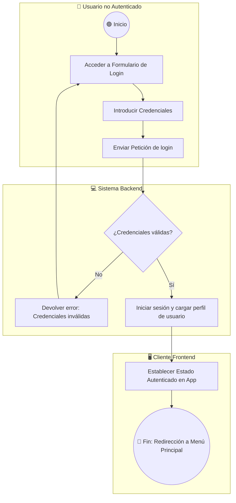
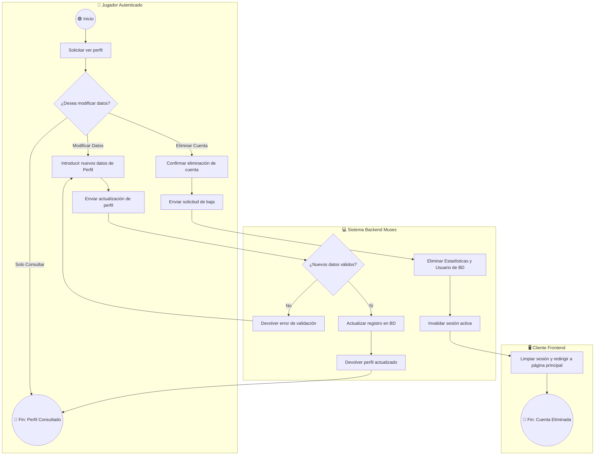
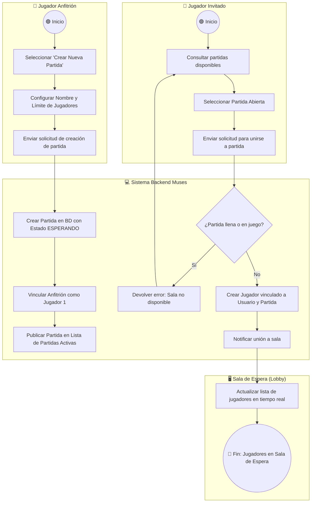
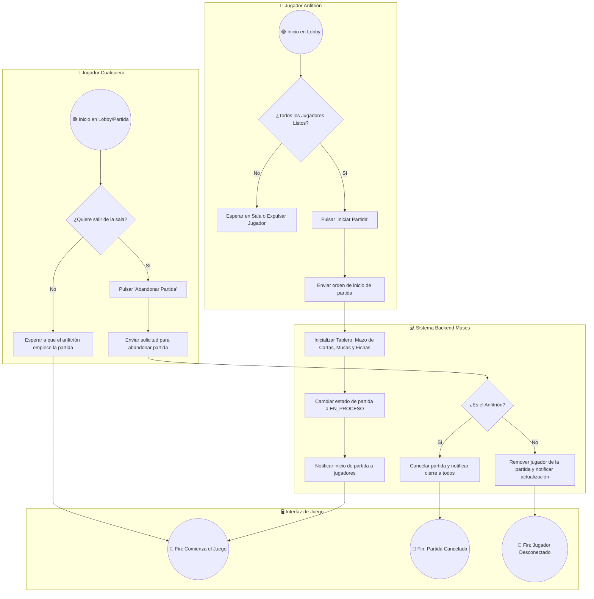
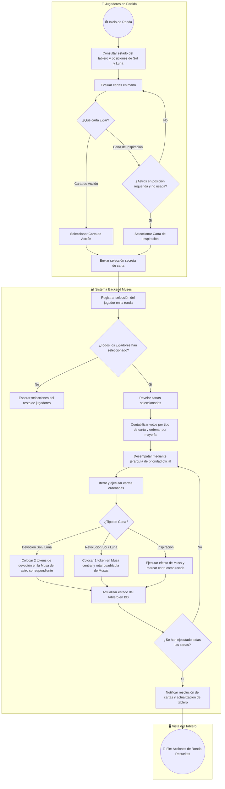
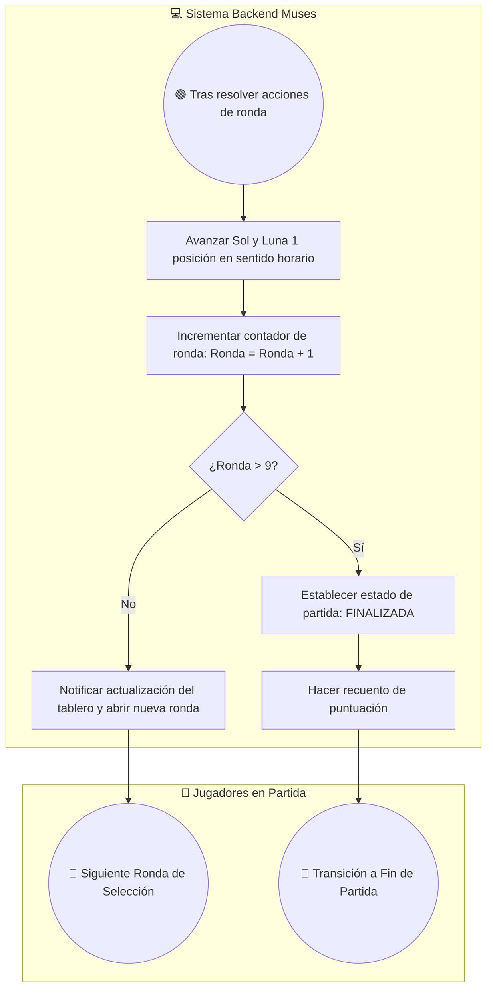
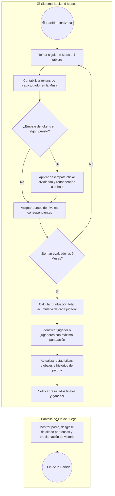
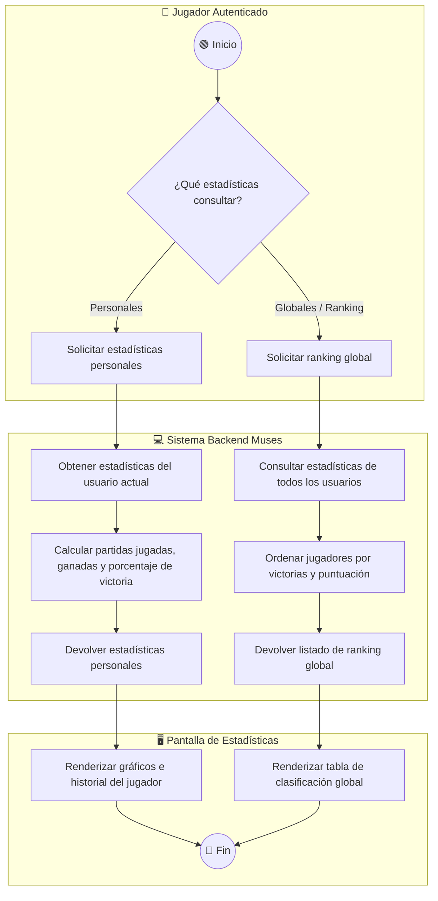
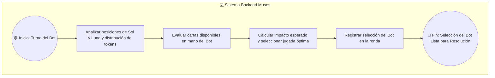

# Documento de Procesos de Negocio (BPMN) - Muses TFG

Este documento recoge la especificación y modelado de los **Procesos de Negocio** para la digitalización del juego de mesa **Muses**, cubriendo la totalidad de los Casos de Uso del sistema.

Los diagramas están elaborados utilizando la notación **Mermaid (`flowchart TD`)** compatible con BPMN 2.0 (eventos, tareas, decisiones y carriles de roles o *swimlanes*).

---

## 1. Simbología BPMN empleada en Mermaid

| Elemento BPMN | Representación gráfica | Sintaxis Mermaid | Descripción |
| :--- | :--- | :--- | :--- |
| **Evento** | Círculo | `(( Nombre del Evento ))` | Indica inicio, estado intermedio o fin del proceso. |
| **Tarea / Actividad** | Rectángulo | `[ Descripción de la Tarea ]` | Acción o paso ejecutado por un rol o sistema. |
| **Decisión / Compuerta** | Rombo | `{ ¿Condición? }` | Punto de bifurcación de flujo según resultado. |
| **Carril / Rol (Swimlane)** | Subgrafo / Contenedor | `subgraph Rol ["Rol"] ... end` | Define la entidad u actor responsable de la acción. |

---

## 2. Matriz de Casos de Uso vs Roles de Sistema

| Código CU | Nombre del Caso de Uso | Rol Principal | Rol Secundario / Sistema |
| :--- | :--- | :--- | :--- |
| **CU-08** | Registrar e Iniciar Sesión de Usuario | Usuario no Autenticado | Sistema Backend / Base de Datos |
| **CU-20** | Consultar Perfil y Estadísticas | Jugador Autenticado | Sistema Backend |
| **CU-33** | Crear Sala de Juego | Jugador Anfitrión | Sistema Backend |
| **CU-34** | Unirse a la Sala de Juego | Jugador Invitado | Sistema Backend |
| **CU-35** | Gestionar Desconexión de Jugadores | Sistema Backend | Jugadores / Bot Autómata |
| **CU-09** | Generar Disposición Inicial de 9 Musas | Sistema Backend | Tablero de Juego |
| **CU-10** | Repartir Cartas de Acción Iniciales | Sistema Backend | Jugadores en Partida |
| **CU-11** | Asignar Carta de Inspiración | Sistema Backend | Jugadores en Partida |
| **CU-12** | Establecer Posición Inicial de Sol y Luna | Sistema Backend | Tablero de Juego |
| **CU-01** | Identificar Musas en Posición de Sol y Luna | Sistema Backend | Tablero de Juego |
| **CU-02** | Mover Tokens Sol y Luna en Sentido Horario | Sistema Backend | Tablero de Juego |
| **CU-03** | Rotar en Revolución las Musas del Tablero | Sistema Backend | Tablero de Juego |
| **CU-04** | Seleccionar Carta de Acción / Inspiración | Jugador en Partida | Sistema Backend |
| **CU-05** | Resolver Conflictos de Prioridad y Votación | Sistema Backend | Jugadores en Partida |
| **CU-06** | Ejecutar Acción de la Carta Jugada | Sistema Backend | Tablero de Juego / Jugadores |
| **CU-07** | Validar Disponibilidad de Carta de Inspiración | Sistema Backend | Jugador Activo |
| **CU-13** | Incrementar Contador de Ronda | Sistema Backend | Estado de Partida |
| **CU-14** | Finalizar Sesión de Juego tras Ronda 9 | Sistema Backend | Estado de Partida |
| **CU-15** | Contabilizar Tokens de Devoción por Musa | Sistema Backend | Jugadores / Tablero |
| **CU-16** | Calcular Puntos Obtenidos por Musa | Sistema Backend | Jugadores en Partida |
| **CU-17** | Resolver Empates de Puntuación | Sistema Backend | Jugadores en Partida |
| **CU-18** | Calcular Puntuación Final de Jugadores | Sistema Backend | Jugadores en Partida |
| **CU-19** | Determinar Ganador de la Partida | Sistema Backend | Jugadores en Partida |
| **CU-31** | Calcular Mejor Jugada para Bot | Bot Autómata | Sistema Backend |
| **CU-32** | Ejecutar Acciones del Bot | Sistema Backend | Bot Autómata |

---

## 3. Diagramas de Procesos de Negocio por Módulo

### Módulo 1: Gestión de Usuarios y Autenticación (CU-08, CU-20)

#### Proceso 1.1: Registro de Nuevo Usuario (CU-08)

#### Proceso 1.2: Iniciar Sesión / Login (CU-08)

#### Proceso 1.3: Gestión de Perfil de Usuario (CU-20)

---

### Módulo 2: Gestión de Partidas y Lobbies (CU-33, CU-34, CU-35, CU-09 a CU-12)

#### Proceso 2.1: Crear Partida (CU-33) y Unirse a Lobby (CU-34)

#### Proceso 2.2: Iniciar (CU-09 a CU-12) y Abandonar/Desconexión de Partida (CU-35)

---

### Módulo 3: Desarrollo de la Ronda y Mecánicas de Juego (CU-01 a CU-07, CU-13 a CU-19)

#### Proceso 3.1: Ronda de Juego - Selección de Cartas y Resolución por Mayoría/Prioridad (CU-04, CU-05, CU-06, CU-07)

#### Proceso 3.2: Fin de Ronda y Mantenimiento Astral (CU-02, CU-13, CU-14)

#### Proceso 3.3: Recuento de Puntuación y Proclamación de Ganador (CU-15 a CU-19)

---

### Módulo 4: Estadísticas, Ranking y Bot Autómata (CU-20, CU-31, CU-32)

#### Proceso 4.1: Consulta de Estadísticas Personales y Globales (CU-20)

#### Proceso 4.2: Toma de Decisiones y Ejecución del Bot (CU-31, CU-32)

---

## 4. Conclusión

Este documento proporciona una visión completa e integrada de los **Casos de Uso** del sistema **Muses**. Todos los diagramas utilizan un nivel de abstracción conceptual centrado en la lógica de negocio y en las reglas oficiales del juego de mesa, libre de detalles de implementación de bajo nivel como endpoints de API o códigos HTTP.
