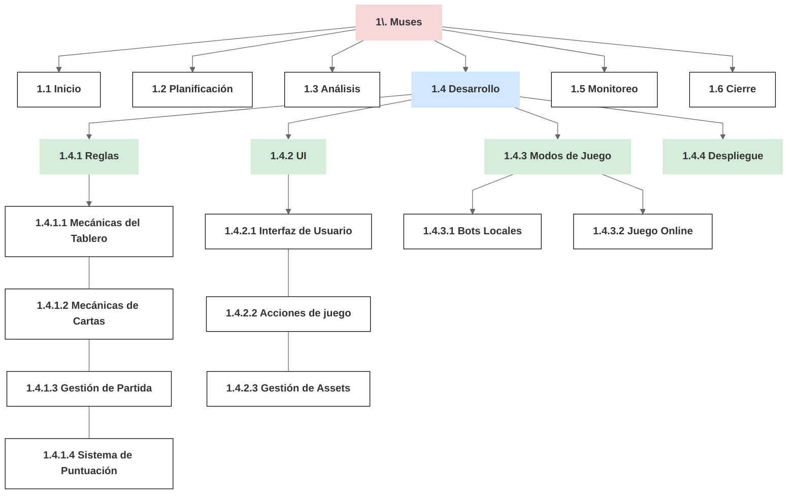

# Estructura de Desglose de Trabajo (EDT) y Lista de Características

## Estructura de Desglose de Trabajo (EDT)

## Lista de Características (Feature List - FDD)

Esta lista actúa como el diccionario de la EDT para los paquetes de trabajo de desarrollo (1.3.1 y 1.3.2), siguiendo la sintaxis FDD: `<acción> <resultado> <objeto>`.
### Reglas - Mecánicas del Tablero (1.4.1.1)
1. **Identificar** Musas en posición de Sol y Luna.
2. **Mover** un espacio en sentido horario el token de Sol y de Luna.
3. **Rotar** en Revolución las Musas del tablero.

### Reglas - Mecánicas de Cartas (1.4.1.2)
4. **Seleccionar** la carta de acción desde la mano del jugador.
5. **Resolver** los conflictos de prioridad en las cartas jugadas.
6. **Ejecutar** la acción de la carta jugada.
7. **Validar** la disponibilidad de la carta de Inspiración.

### Reglas - Gestión de Partida (1.4.1.3)
9. **Generar** la disposición inicial de las 9 Musas en el tablero.
10. **Repartir** las cartas de acción iniciales a los jugadores.
11. **Asignar** una carta de Inspiración a cada jugador.
12. **Establecer** la posición inicial de los tokens de Sol y Luna.
13. **Incrementar** el contador de ronda al finalizar el turno.
14. **Finalizar** la sesión de juego al completar la novena ronda.

### Reglas - Sistema de Puntuación (1.4.1.4)
15. **Contabilizar** los tokens de devoción por jugador en cada Musa.
16. **Calcular** los puntos obtenidos por cada Musa.
17. **Resolver** los empates de puntuación.
18. **Calcular** la puntuación final de cada jugador.
19. **Determinar** el ganador de la partida.

### UI - Interfaz de Usuario (1.4.2.1)
21. **Renderizar** las musas y tokens del tablero.
22. **Mostrar** las cartas disponibles en el área del jugador.
23. **Mostrar** el estado del turno.
24. **Mostrar** el resumen de puntuación al finalizar la partida.

### UI - Acciones de juego (1.4.2.2)
25. **Animar** el desplazamiento de los tokens de devoción.
26. **Resaltar** las cartas de Musa afectadas por la acción.
27. **Implementar** la selección de cartas.

### UI - Gestión de Assets (1.4.2.3)
28. **Mostrar** las ilustraciones originales de las Musas.
29. **Mostrar** las ilustraciones de las cartas y tokens.
30. **Mostrar** las ilustraciones de los tokens.

### Modos de Juego - Bots Locales (1.4.3.1)
31. **Calcular** la mejor jugada posible para el bot.
32. **Ejecutar** las acciones seleccionadas por el bot.

### Modos de Juego - Juego Online (1.4.3.2)
33. **Crear** la sala de juego.
34. **Unirse** a la sala de juego.
35. **Gestionar** la desconexión de jugadores durante la partida.

### Despliegue (1.4.4)
36. **Automatizar** las pruebas de integración en cada cambio.
37. **Generar** la versión optimizada para web.
38. **Publicar** el acceso al juego en internet.