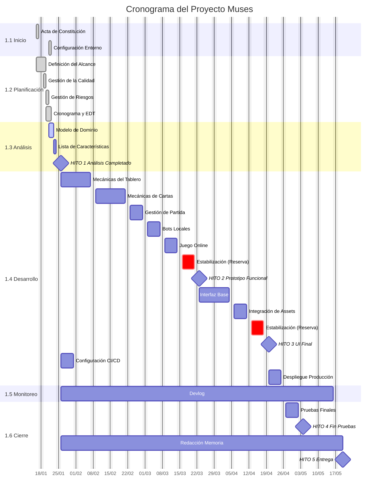

# Gestión del Cronograma

## 1. Enfoque de Gestión del Cronograma
Esta sección define el marco general para la creación y mantenimiento del cronograma de este proyecto.

*   **Herramientas:** El cronograma se desarrolla y mantiene utilizando diagramas de Gantt en **Mermaid (Markdown)**. El control de versiones de este archivo a través de Git permitirá auditar la evolución histórica de la planificación.
*   **Metodología:** Se utiliza una planificación de **Rolling Wave**. Las tareas de la fase inminente se detallan a nivel de paquete de trabajo (1-2 semanas), mientras que las fases futuras se mantienen como bloques de alto nivel hasta que se aproxima su ejecución.
*   **Estimación:** La duración de las actividades se estima en **días laborables**, basándose en la complejidad técnica esperada. Esta estimación es preliminar e irá iterando hasta su finalización.
*   **Reservas de Contingencia:** Se reservará **1 semana (5 días laborables)** de estabilización al final de cada hito principal de desarrollo (Prototipo y UI Final) para corregir deuda técnica o bugs imprevistos sin comprometer la fecha final.

Los hitos principales del cronograma son:
1.  Análisis Completado.
2.  Prototipo Funcional (Core).
3.  Interfaz de Usuario Final.
4.  Fin de Pruebas.
5.  Entrega Final.

**Línea Base del Cronograma (Versión 1.0 - 21/01/2026)**
El siguiente cuadro establece las fechas objetivo aprobadas. Cualquier desviación será medida contra estas referencias:

| Hito Principal                         | Fecha Objetivo |
| :------------------------------------- | -------------: |
| **HITO 1:** Análisis Completado        |     26/01/2026 |
| **HITO 2:** Prototipo Funcional (Core) |     23/03/2026 |
| **HITO 3:** Interfaz de Usuario Final  |     20/04/2026 |
| **HITO 4:** Fin de Pruebas             |     04/05/2026 |
| **HITO 5:** Entrega Final              |     20/05/2026 |

## 2. Control del Cronograma
El control del cronograma asegura que el proyecto se mantiene alineado con la Línea Base planificada.

*   **Frecuencia de Actualización:** El cronograma será revisado y actualizado **semanalmente** (cada lunes). Se registrarán las fechas reales de inicio y fin de las tareas completadas.
*   **Medición del Avance:** Para evitar estimaciones subjetivas, se aplicará el método **0/50/100**:
    *   **0%:** Tarea no iniciada.
    *   **50%:** Tarea en curso (independientemente del esfuerzo invertido).
    *   **100%:** Tarea completada, probada y validada (Definition of Done).

## 3. Cambios y Umbrales de Desviación
Se establecen límites de tolerancia para gestionar las variaciones sin necesidad de replanificar todo el proyecto.

*   **Umbral de Alerta (10%):** Si una tarea crítica se desvía más de un **10%** de su duración estimada (o >3 días), se deberá documentar la causa y proponer una acción inmediata (ej. horas extra el fin de semana).
*   **Registro de Desviaciones:** Si la desviación acumulada amenaza la fecha de un Hito Principal en más de **1 semana**, se registrará la incidencia en el **Devlog (Diario de Proyecto)**, documentando la causa y la decisión tomada (ej. reducir alcance o reajustar tareas futuras)

## 4. Gestión de Recortes de Alcance (De-scoping)
Dado que la fecha meta del 20/05/2026 se establece como objetivo prioritario, en caso de desviación crítica se priorizará el ajuste del **alcance** (De-scoping) sobre la extensión del plazo.

Si se detecta una falta de tiempo irrecuperable, se procederá al recorte de funcionalidades en el siguiente orden de prioridad (de lo primero en eliminarse a lo último):
1.  Animaciones y efectos visuales avanzados.
2.  Modo multijugador online (quedando solo local).
3.  Bots (quedando solo hotseat).

Este mecanismo asegura que, incluso en el peor escenario, se entregue un producto funcional y jugable (MVP).

---

## 5. Cronograma del Proyecto (Gantt)

