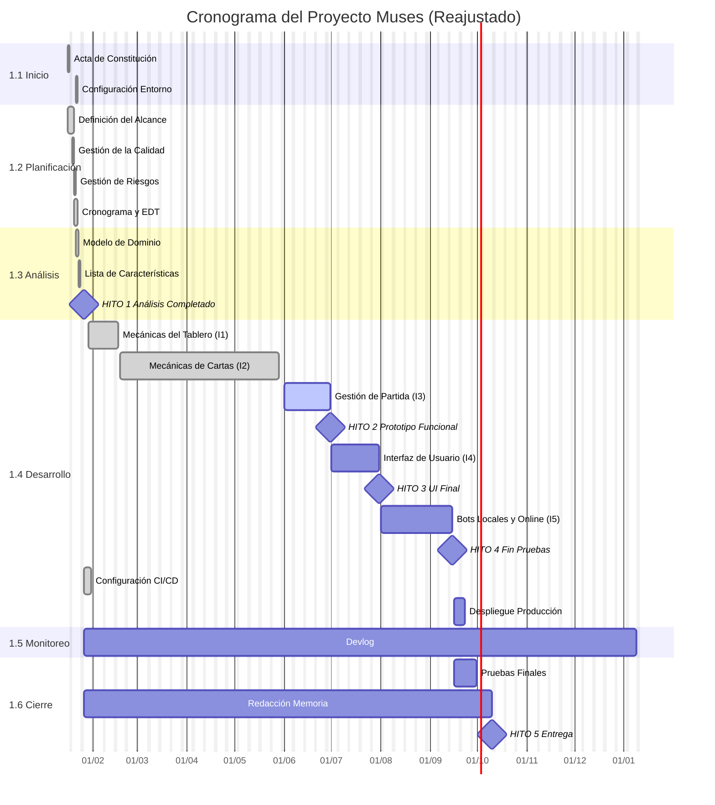

# Gestión del Cronograma

## 1. Enfoque de Gestión del Cronograma
Esta sección define el marco general para la creación y mantenimiento del cronograma de este proyecto.

*   **Herramientas:** El cronograma se desarrolla y mantiene utilizando diagramas de Gantt en **Mermaid (Markdown)**. El control de versiones de este archivo a través de Git permitirá auditar la evolución histórica de la planificación.
*   **Metodología:** Se utiliza una planificación de **Rolling Wave**. Las tareas de la fase inminente se detallan a nivel de paquete de trabajo (1-2 semanas), mientras que las fases futuras se mantienen como bloques de alto nivel hasta que se aproxima su ejecución.
*   **Estimación:** La duración de las actividades se estima en **días laborables**, basándose en la complejidad técnica esperada. Esta estimación es preliminar e irá iterando hasta su finalización.
*   **Reservas de Contingencia:** Se reservará **1 semana (5 días laborables)** de estabilización al final de cada hito principal de desarrollo (Prototipo y UI Final) para corregir deuda técnica o bugs imprevistos sin comprometer la fecha final.

Los hitos principales del cronograma son:
1.  Análisis Completado.
2.  Prototipo Funcional (Core).
3.  Interfaz de Usuario Final.
4.  Fin de Pruebas.
5.  Entrega Final.

**Línea Base del Cronograma (Versión 1.0 - 21/01/2026)**
El siguiente cuadro establece las fechas objetivo inicialmente aprobadas:

| Hito Principal                         | Fecha Objetivo |
| :------------------------------------- | -------------: |
| **HITO 1:** Análisis Completado        |     26/01/2026 |
| **HITO 2:** Prototipo Funcional (Core) |     23/03/2026 |
| **HITO 3:** Interfaz de Usuario Final  |     20/04/2026 |
| **HITO 4:** Fin de Pruebas             |     04/05/2026 |
| **HITO 5:** Entrega Final              |     20/05/2026 |

**Línea Base Reajustada (Versión 2.0 - 01/06/2026)**
Debido a los retrasos técnicos y personales acumulados en el primer cuatrimestre del año, se ha reestructurado el cronograma para extender la entrega hasta el 10/10/2026:

| Hito Principal                         | Fecha Objetivo |
| :------------------------------------- | -------------: |
| **HITO 1:** Análisis Completado        |     26/01/2026 |
| **HITO 2:** Prototipo Funcional (Core) |     30/06/2026 |
| **HITO 3:** Interfaz de Usuario Final  |     31/07/2026 |
| **HITO 4:** Fin de Pruebas             |     15/09/2026 |
| **HITO 5:** Entrega Final              |     10/10/2026 |

## 1.1 Asignación de Características (Features) a Iteraciones

Para asegurar la trazabilidad completa y garantizar que todas las características estén planificadas en el cronograma, se detalla la asignación de las features de la EDT a cada iteración:

*   **Iteración 1: Mecánicas del Tablero** (Completada)
    *   **F01:** Identificar Musas en posición de Sol y Luna.
    *   **F02:** Mover un espacio en sentido horario el token de Sol y de Luna.
    *   **F03:** Rotar en Revolución las Musas del tablero.
*   **Iteración 2: Mecánicas de Cartas** (Completada)
    *   **F04:** Seleccionar la carta de acción desde la mano del jugador.
    *   **F05:** Resolver los conflictos de prioridad en las cartas jugadas.
    *   **F06:** Ejecutar la acción de la carta jugada.
    *   **F07:** Validar la disponibilidad de la carta de Inspiración.
*   **Iteración 3: Gestión de Partida y Sistema de Puntuación** (En curso)
    *   **F09:** Generar la disposición inicial de las 9 Musas en el tablero.
    *   **F10:** Repartir las cartas de acción iniciales a los jugadores.
    *   **F11:** Asignar una carta de Inspiración a cada jugador.
    *   **F12:** Establecer la posición inicial de los tokens de Sol y Luna.
    *   **F13:** Incrementar el contador de ronda al finalizar el turno.
    *   **F14:** Finalizar la sesión de juego al completar la novena ronda.
    *   **F15:** Contabilizar los tokens de devoción por jugador en cada Musa.
    *   **F16:** Calcular los puntos obtenidos por cada Musa.
    *   **F17:** Resolver los empates de puntuación.
    *   **F18:** Calcular la puntuación final de cada jugador.
    *   **F19:** Determinar el ganador de la partida.
*   **Iteración 4: Interfaz de Usuario y Assets** (Planificada)
    *   **F21:** Renderizar las musas y tokens del tablero.
    *   **F22:** Mostrar las cartas disponibles en el área del jugador.
    *   **F23:** Mostrar el estado del turno.
    *   **F24:** Mostrar el resumen de puntuación al finalizar la partida.
    *   **F25:** Animar el desplazamiento de los tokens de devoción.
    *   **F26:** Resaltar las cartas de Musa afectadas por la acción.
    *   **F27:** Implementar la selección de cartas.
    *   **F28:** Mostrar las ilustraciones originales de las Musas.
    *   **F29:** Mostrar las ilustraciones de las cartas y tokens.
    *   **F30:** Mostrar las ilustraciones de los tokens.
*   **Iteración 5: Modos de Juego (Bots y Online)** (Planificada)
    *   **F31:** Calcular la mejor jugada posible para el bot.
    *   **F32:** Ejecutar las acciones seleccionadas por el bot.
    *   **F33:** Crear la sala de juego.
    *   **F34:** Unirse a la sala de juego.
    *   **F35:** Gestionar la desconexión de jugadores durante la partida.
*   **Fase de Cierre y Despliegue** (Planificada)
    *   **F36:** Automatizar las pruebas de integración en cada cambio.
    *   **F37:** Generar la versión optimizada para web.
    *   **F38:** Publicar el acceso al juego en internet.

## 2. Control del Cronograma
El control del cronograma asegura que el proyecto se mantiene alineado con la Línea Base planificada.

*   **Frecuencia de Actualización:** El cronograma será revisado y actualizado **semanalmente** (cada lunes). Se registrarán las fechas reales de inicio y fin de las tareas completadas.
*   **Medición del Avance:** Para evitar estimaciones subjetivas, se aplicará el método **0/50/100**:
    *   **0%:** Tarea no iniciada.
    *   **50%:** Tarea en curso (independientemente del esfuerzo invertido).
    *   **100%:** Tarea completada, probada y validada (Definition of Done).

## 3. Cambios y Umbrales de Desviación
Se establecen límites de tolerancia para gestionar las variaciones sin necesidad de replanificar todo el proyecto.

*   **Umbral de Alerta (10%):** Si una tarea crítica se desvía más de un **10%** de su duración estimada (o >3 días), se deberá documentar la causa y proponer una acción inmediata (ej. horas extra el fin de semana).
*   **Registro de Desviaciones:** Si la desviación acumulada amenaza la fecha de un Hito Principal en más de **1 semana**, se registrará la incidencia en el **Devlog (Diario de Proyecto)**, documentando la causa y la decisión tomada (ej. reducir alcance o reajustar tareas futuras)

## 4. Gestión de Recortes de Alcance (De-scoping)
Dado que la fecha meta del 10/10/2026 se establece como objetivo prioritario, en caso de desviación crítica se priorizará el ajuste del **alcance** (De-scoping) sobre la extensión del plazo.

Si se detecta una falta de tiempo irrecuperable, se procederá al recorte de funcionalidades en el siguiente orden de prioridad (de lo primero en eliminarse a lo último):
1.  Animaciones y efectos visuales avanzados.
2.  Modo multijugador online (quedando solo local).
3.  Bots (quedando solo hotseat).

Este mecanismo asegura que, incluso en el peor escenario, se entregue un producto funcional y jugable (MVP).

---

## 5. Cronograma del Proyecto (Gantt)

```mermaid
%%{init: {'gantt': {'barHeight': 30, 'fontSize': 10, 'weekStart': 1}}}%%
gantt
    title Cronograma del Proyecto Muses (Reajustado)
    dateFormat  YYYY-MM-DD
    axisFormat  %d/%m
    excludes    weekends

    section 1.1 Inicio
    Acta de Constitución       :done, a1, 2026-01-16, 1d
    Configuración Entorno      :done, a2, 2026-01-21, 1d

    section 1.2 Planificación
    Definición del Alcance     :done, p3, 2026-01-16, 2d
    Gestión de la Calidad      :done, p4, 2026-01-19, 1d
    Gestión de Riesgos         :done, p2, 2026-01-20, 1d
    Cronograma y EDT           :done, p1, 2026-01-20, 2d

    section 1.3 Análisis
    Modelo de Dominio          :done, ana1, 2026-01-21, 2d
    Lista de Características   :done, ana2, after ana1, 1d
    HITO 1 Análisis Completado :milestone, m1, 2026-01-26, 0d
    
    section 1.4 Desarrollo
    Mecánicas del Tablero (I1) :done, d1, 2026-01-29, 2026-02-17
    Mecánicas de Cartas (I2)   :done, d2, 2026-02-18, 2026-05-29
    Gestión de Partida (I3)    :active, d3, 2026-06-01, 2026-06-30
    HITO 2 Prototipo Funcional :milestone, m2, 2026-06-30, 0d
    Interfaz de Usuario (I4)   :ui1, 2026-07-01, 2026-07-31
    HITO 3 UI Final            :milestone, m3, 2026-07-31, 0d
    Bots Locales y Online (I5) :modj1, 2026-08-01, 2026-09-15
    HITO 4 Fin Pruebas         :milestone, m4, 2026-09-15, 0d

    Configuración CI/CD        :done, devops1, 2026-01-26, 5d
    Despliegue Producción      :devops2, 2026-09-16, 5d

    section 1.5 Monitoreo
    Devlog                     :mon1, 2026-01-26, 250d

    section 1.6 Cierre
    Pruebas Finales            :test1, 2026-09-16, 10d
    Redacción Memoria          :doc1, 2026-01-26, 2026-10-10
    HITO 5 Entrega             :milestone, m5, 2026-10-10, 0d
```
